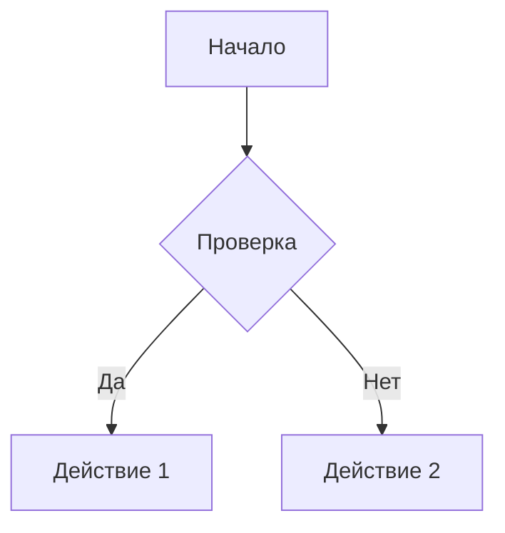
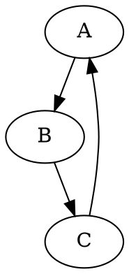

# Markdown Document Converter

Профессиональный инструмент для конвертации Markdown документов в PDF и Word с полной поддержкой русского языка, диаграмм и ASCII-рисунков.

## 🚀 Доступно в трех версиях

1. **CLI версия** - Мощный инструмент командной строки для автоматизации и пакетной обработки
2. **WEB версия (Flask)** - Серверное веб-приложение с REST API ([см. web/README.md](web/README.md))
3. **WEB версия (Static)** - Полностью клиентское приложение для любого хостинга ([см. web-static/README.md](web-static/README.md)) ⭐ **Новое!**

## Возможности

- **Конвертация в PDF и DOCX** - высококачественное преобразование с сохранением форматирования
- **Полная поддержка Markdown** - заголовки, списки, таблицы, цитаты, ссылки, изображения
- **Подсветка синтаксиса кода** - JavaScript, Python, SQL, JSON, Bash и многие другие (через Pygments)
- **Русский язык** - правильная типографика и шрифты DejaVu для кириллицы
- **ASCII-рисунки** - 3 режима обработки: конвертация в изображение, оптимизация размера, сохранение как есть
- **Диаграммы** - автоматический рендеринг Mermaid и GraphViz диаграмм
- **Метаданные YAML** - поддержка front matter для title, author, date, order
- **Стили оформления** - 3 встроенных стиля: default, professional, minimal
- **Пакетная обработка** - конвертация множества файлов одной командой

## Установка

### 1. Установка Python зависимостей

```bash
# Создание виртуального окружения (рекомендуется)
python3 -m venv venv
source venv/bin/activate  # Linux/Mac
# или
venv\Scripts\activate  # Windows

# Установка приложения
pip install -e .
```

### 2. Установка системных зависимостей

#### WeasyPrint (для PDF)

**Ubuntu/Debian:**
```bash
sudo apt-get install python3-dev python3-pip python3-setuptools python3-wheel \
  python3-cffi libcairo2 libpango-1.0-0 libpangocairo-1.0-0 \
  libgdk-pixbuf2.0-0 libffi-dev shared-mime-info
```

**macOS:**
```bash
brew install cairo pango gdk-pixbuf libffi
```

**Windows:**
См. [документацию WeasyPrint](https://doc.courtbouillon.org/weasyprint/stable/first_steps.html#windows)

#### Шрифты для русского языка

**Ubuntu/Debian:**
```bash
sudo apt-get install fonts-dejavu fonts-dejavu-core fonts-dejavu-extra
```

**macOS:**
```bash
brew install --cask font-dejavu
```

#### Опционально: Инструменты для диаграмм

**Mermaid CLI (для Mermaid диаграмм):**
```bash
npm install -g @mermaid-js/mermaid-cli
```

**GraphViz (для GraphViz диаграмм):**
```bash
# Ubuntu/Debian
sudo apt-get install graphviz

# macOS
brew install graphviz

# Windows
# Скачать с https://graphviz.org/download/
```

## Быстрый старт

### Базовая конвертация

```bash
# Конвертация одного файла в PDF
md-converter input.md -o output.pdf

# Конвертация в Word
md-converter input.md -o output.docx -f docx

# Конвертация в оба формата
md-converter input.md -f both
```

### Пакетная обработка

```bash
# Конвертация всех MD файлов в директории
md-converter *.md -f pdf --batch

# Конвертация документации проекта
md-converter docs/*.md -f both --batch --style professional
```

### Стили документов

```bash
# Стандартный стиль (default)
md-converter document.md -o output.pdf

# Профессиональный стиль для технической документации
md-converter document.md -f pdf --style professional

# Минималистичный стиль
md-converter document.md -f pdf --style minimal
```

### Обработка ASCII-арта

```bash
# Оптимизация размера шрифта (по умолчанию)
md-converter document.md -f pdf --ascii-mode optimize

# Конвертация ASCII в изображения
md-converter document.md -f pdf --ascii-mode image

# Сохранение ASCII как есть
md-converter document.md -f pdf --ascii-mode preserve
```

## Использование

### Полный синтаксис команды

```bash
md-converter [INPUT_FILES...] [OPTIONS]
```

### Опции

- `-o, --output PATH` - Путь к выходному файлу
- `-f, --format [pdf|docx|both]` - Формат вывода (по умолчанию: pdf)
- `--style [default|professional|minimal]` - Стиль документа
- `--ascii-mode [optimize|image|preserve]` - Режим обработки ASCII-арта
- `--batch` - Пакетная обработка файлов
- `-v, --verbose` - Подробный вывод

### Примеры

#### Пример 1: Техническая документация

```bash
md-converter tech-spec.md \
  -o tech-spec.pdf \
  -f pdf \
  --style professional \
  --ascii-mode optimize
```

#### Пример 2: Пакетная конвертация документации

```bash
md-converter docs/section-*.md \
  -f both \
  --batch \
  --style professional \
  --verbose
```

#### Пример 3: Конвертация с диаграммами

```bash
# Убедитесь что установлен mermaid-cli или graphviz
md-converter architecture.md \
  -o architecture.pdf \
  --style professional
```

## Формат документа

### YAML Front Matter (метаданные)

Добавьте метаданные в начало MD файла:

```markdown
---
title: "Название документа"
author: "Автор"
date: "2024-01-15"
order: 1.5
---

# Содержимое документа...
```

Метаданные используются для:
- Заголовка документа
- Имени автора в свойствах файла
- Даты создания
- Сортировки при пакетной обработке

### Поддерживаемые элементы Markdown

#### Базовые элементы
- Заголовки (H1-H6)
- Параграфы
- Списки (упорядоченные и неупорядоченные)
- Таблицы (GitHub Flavored Markdown)
- Ссылки
- Изображения
- Цитаты
- Горизонтальные линии

#### Расширенные элементы
- Блоки кода с подсветкой синтаксиса
- YAML Front Matter
- Mermaid диаграммы
- GraphViz диаграммы
- ASCII-арт

### Примеры Markdown

#### Код с подсветкой синтаксиса

````markdown
```python
def hello_world():
    print("Привет, мир!")
```
````

#### Таблицы

```markdown
| Заголовок 1 | Заголовок 2 | Заголовок 3 |
|-------------|-------------|-------------|
| Ячейка 1    | Ячейка 2    | Ячейка 3    |
| Данные      | Данные      | Данные      |
```

#### Mermaid диаграммы

````markdown

````

#### GraphViz диаграммы

````markdown

````

## Архитектура проекта

```
md_converter/
├── __init__.py           # Основной модуль
├── parser.py             # Парсер Markdown
├── pdf_generator.py      # Генератор PDF (WeasyPrint)
├── word_generator.py     # Генератор Word (python-docx)
├── diagram_processor.py  # Обработка диаграмм (Mermaid, GraphViz)
├── ascii_processor.py    # Обработка ASCII-арта
├── cli.py                # CLI интерфейс (Click + Rich)
├── styles/               # CSS стили для PDF
│   ├── default.css       # Стандартный стиль
│   ├── professional.css  # Профессиональный стиль
│   └── minimal.css       # Минималистичный стиль
├── requirements.txt      # Python зависимости
└── README.md             # Документация модуля
```

## Troubleshooting

### Проблема: WeasyPrint не устанавливается

**Решение:** Убедитесь что установлены системные зависимости:
```bash
sudo apt-get install python3-dev libcairo2-dev libpango1.0-dev
```

### Проблема: Диаграммы не рендерятся

**Решение:** Установите соответствующие инструменты:
```bash
# Для Mermaid
npm install -g @mermaid-js/mermaid-cli

# Для GraphViz
sudo apt-get install graphviz  # Linux
brew install graphviz          # macOS
```

Если инструменты не установлены, будет создана заглушка с сообщением.

### Проблема: Кириллица не отображается

**Решение:** Установите шрифты DejaVu:
```bash
sudo apt-get install fonts-dejavu fonts-dejavu-core fonts-dejavu-extra
```

### Проблема: Ошибка при обработке больших таблиц

**Решение:** Используйте стиль `minimal` для уменьшения размера шрифта:
```bash
md-converter large-table.md --style minimal
```

### Проблема: ASCII-арт не помещается на страницу

**Решение:** Используйте режим `--ascii-mode optimize` или `--ascii-mode image`:
```bash
md-converter diagram.md --ascii-mode optimize
```

## Производительность

Время конвертации зависит от:
- Размера документа
- Количества изображений
- Количества диаграмм
- Сложности таблиц

**Примерные показатели:**
- 10-страничный документ: ~2-5 секунд
- 50-страничный документ: ~10-20 секунд
- Документ с 10 диаграммами: +5-10 секунд на рендеринг

## Зависимости

### Обязательные
- Python 3.8+
- markdown >= 3.5.0
- python-docx >= 1.1.0
- weasyprint >= 60.0
- Pillow >= 10.0.0
- pygments >= 2.16.0
- click >= 8.1.0
- rich >= 13.0.0
- PyYAML >= 6.0

### Опциональные
- mermaid-cli (для Mermaid диаграмм)
- graphviz (для GraphViz диаграмм)

Полный список см. в `md_converter/requirements.txt`

## Лицензия

MIT License

Copyright (c) 2024 OCTA Team

## Вклад в проект

Приветствуются pull requests и issue с предложениями по улучшению!

## Поддержка

Для вопросов и предложений создавайте issue в репозитории.

## Авторы

OCTA Team

## Версия

1.0.0
