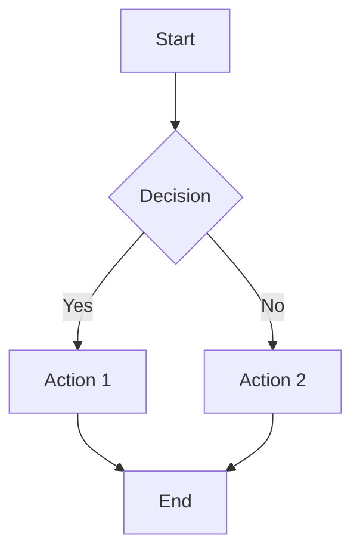

# Markdown to Word Converter

Полностью клиентский веб-конвертер Markdown в Word (DOCX) с поддержкой ASCII Art диаграмм.

## 🌟 Особенности

- **100% клиентская обработка** - все файлы обрабатываются локально в вашем браузере
- **Полная приватность** - ваши файлы никогда не загружаются на сервер
- **Без установки** - просто откройте в браузере
- **Без регистрации** - бесплатно и анонимно
- **Работает офлайн** - после первой загрузки можно использовать без интернета

## 🚀 Возможности

### Формат вывода
- **DOCX** - Microsoft Word документ с полной поддержкой форматирования

### Поддерживаемые элементы Markdown
- Заголовки (H1-H6)
- Параграфы и текст
- Списки (упорядоченные и неупорядоченные)
- Таблицы
- Ссылки
- Изображения
- Цитаты (blockquote)
- Блоки кода с подсветкой синтаксиса
- **Mermaid диаграммы** - flowcharts, sequence diagrams, gantt и другие
- **ASCII Art диаграммы** - автоматическое преобразование в SVG
- YAML Front Matter для метаданных

### Подсветка синтаксиса
Поддерживается через Highlight.js:
- JavaScript, TypeScript
- Python
- SQL
- JSON, YAML
- HTML, CSS
- Bash/Shell
- И многие другие языки

### 🎭 ASCII Art диаграммы

Конвертер автоматически распознает и преобразует ASCII art в SVG для предпросмотра!

Используйте код блоки с языком `ascii`, `ascii-art` или `diagram`:

````markdown
```ascii
+-------+       +-------+
| Start | ----> |  End  |
+-------+       +-------+
```
````

## 📦 Технологии

### Библиотеки (загружаются из CDN)
- **markdown-it** v13.0.2 - парсинг Markdown
- **Highlight.js** v11.9.0 - подсветка синтаксиса кода
- **docx.js** v6.0.3 - генерация DOCX файлов
- **file-saver** v2.0.5 - сохранение файлов
- **mermaid** v10.6.1 - диаграммы Mermaid
- **js-yaml** v4.1.0 - парсинг YAML front matter
- **svgbob-wasm** v1.0.0 - преобразование ASCII art в SVG через WebAssembly

## 🌐 Деплой

### Вариант 1: GitHub Pages (Автоматический) ⭐ Рекомендуется

**Автоматический деплой через GitHub Actions:**

1. Форкните или клонируйте репозиторий
2. Перейдите в Settings → Pages
3. В разделе "Build and deployment":
   - Source: выберите **GitHub Actions**
4. Запуште изменения в ветку `main` или `master`
5. GitHub Actions автоматически задеплоит сайт

Ваш сайт будет доступен по адресу: `https://yourusername.github.io/md/`

### Вариант 2: Локальный запуск

Просто откройте `index.html` в браузере:

```bash
# Откройте файл
open index.html

# Или используйте простой HTTP сервер
python -m http.server 8000
# Затем откройте http://localhost:8000
```

## 📁 Структура проекта

```
md/
├── index.html          # Главная страница
├── css/
│   └── style.css       # Стили
├── js/
│   ├── app.js          # Логика приложения
│   └── ascii-to-svg.js # ASCII Art конвертер (из aasvg)
├── .github/
│   └── workflows/
│       └── deploy.yml  # GitHub Actions для автодеплоя
└── README.md           # Эта документация
```

## 🔧 Использование

### 1. Загрузка файла
- Перетащите `.md`, `.markdown` или `.txt` файл в область загрузки
- Или нажмите "Выберите файл" для выбора из файловой системы
- Максимальный размер: 10MB

### 2. Предпросмотр
После загрузки вы увидите предпросмотр документа с применением всех стилей

### 3. Скачивание
Нажмите "Скачать DOCX" - файл сохранится автоматически

## ✨ Примеры Markdown

### YAML Front Matter
```markdown
---
title: "Мой документ"
author: "Иван Иванов"
date: "2025-11-19"
---

# Содержимое документа
```

### Код с подсветкой
````markdown
```python
def hello_world():
    print("Привет, мир!")
```
````

### Таблицы
```markdown
| Название | Описание | Цена |
|----------|----------|------|
| Товар 1  | Описание | 100₽ |
| Товар 2  | Описание | 200₽ |
```

### Mermaid диаграммы
````markdown

````

### ASCII Art диаграммы
````markdown
```ascii
┌───────────┐        ┌───────────┐
│  Browser  │──HTTP──│  Server   │
└───────────┘        └───────────┘
      │                    │
      └────WebSocket───────┘
```
````

## 🔒 Безопасность и Приватность

### Полная приватность
- Вся обработка происходит локально в вашем браузере
- Файлы НЕ загружаются на какой-либо сервер
- Не используются cookies или аналитика
- Исходный код открыт и доступен для проверки

### Как это работает?
1. Вы выбираете файл
2. JavaScript читает файл локально (File API)
3. markdown-it парсит Markdown в HTML
4. ASCII art преобразуется в SVG через markdeep-diagram.js
5. docx.js генерирует Word документ
6. FileSaver.js сохранивает файл на ваш компьютер

**Ни один байт вашего документа не покидает ваш компьютер!**

## 📄 Лицензия

MIT License

## 🤝 Вклад

Приветствуются pull requests и issues!

## 🔗 Ссылки

- [Основной репозиторий](https://github.com/Sign25/md)
- [svgbob](https://github.com/ivanceras/svgbob) - библиотека для ASCII art
- [svgbob-wasm](https://github.com/agoose77/svgbob-wasm) - WebAssembly обёртка для svgbob

---

**Версия**: 3.3.2
**Последнее обновление**: 2025-11-19

## Changelog

### v3.3.2 (2025-11-19) - Критическое исправление CORS
- 🔥 **Исправлена CORS ошибка при SVG→PNG конвертации**
  - Замена blob URL на data URI (base64) для избежания CORS
  - Использование `canvas.toDataURL()` вместо `canvas.toBlob()`
  - Добавлен `crossOrigin = 'anonymous'` для Image
  - Ручная конвертация data URL в ArrayBuffer
- ✅ **Решена проблема "Tainted canvases may not be exported"**
- ✅ Теперь Mermaid и ASCII диаграммы корректно экспортируются в DOCX

### v3.3.1 (2025-11-19) - Исправление загрузки и отладка
- 🔧 **Исправлена загрузка svgbob-wasm**
  - Попытка загрузки с unpkg с инициализацией WASM (`await svgbobModule.default()`)
  - Fallback на esm.sh при ошибке
  - Детальное логирование процесса загрузки
- 🐛 **Добавлено подробное логирование генерации DOCX**
  - Логи для каждого этапа: загрузка библиотеки, обработка элементов, создание blob
  - Логи для конвертации SVG диаграмм в PNG
  - Подсчет и отображение прогресса обработки элементов
  - Помогает диагностировать проблемы с зависанием

### v3.3.0 (2025-11-19) - Переход на svgbob-wasm
- 🚀 **Заменена библиотека ASCII art** с markdeep-diagram на svgbob-wasm
  - Использование WebAssembly для лучшей производительности
  - Более качественный рендеринг ASCII диаграмм
  - Динамическая загрузка через ES модули (esm.sh CDN)
- ♻️ **Удалён файл ascii-to-svg.js** (1592 строки) - больше не нужен
- ✅ Сохранён fallback на форматированный код при ошибке загрузки WASM
- 🔧 Улучшено логирование загрузки библиотек

### v3.2.1 (2025-11-19) - Исправления
- 🔧 **Исправлена конвертация SVG→PNG** для Mermaid и ASCII диаграмм
  - Правильное извлечение SVG элементов с использованием XMLSerializer
  - Корректные размеры и xmlns атрибуты
  - Подробное логирование процесса конвертации
- 🔧 **Исправлен синтаксис borders** для таблиц (использование BorderStyle enum)
- 🔧 **Улучшена обработка ASCII art**:
  - Попытка конвертации в SVG через библиотеку AsciiToSVG
  - Fallback на форматированный моноширинный код при ошибке конвертации
  - ASCII art всегда отображается в документе (как изображение или как код)
- ✅ Добавлено детальное логирование для отладки

### v3.2.0 (2025-11-19) - Академическое форматирование
- 📐 **Академический стиль документов** - форматирование как в научных публикациях
- 🎨 Шрифт Times New Roman, размеры заголовков и текста по академическим стандартам
- 📏 Выравнивание по ширине, отступ первой строки параграфа
- 📊 Минималистичные таблицы (только верхняя/нижняя границы)
- 🖼️ **SVG→PNG конвертация** - Mermaid и ASCII диаграммы вставляются как изображения в DOCX
- ✅ Блок цитат с академическим форматированием
- ✅ Улучшенное форматирование списков с правильными отступами
- ✅ Поля документа 1 дюйм (2.54 см) со всех сторон

### v3.1.0 (2025-11-19)
- 🔄 Исправлена загрузка библиотеки docx.js (версия изменена на v6.0.3)
- ✅ Восстановлена поддержка Mermaid диаграмм
- ✅ Добавлена обработка Mermaid диаграмм в DOCX экспорте
- ✅ Улучшена обработка ошибок рендеринга диаграмм

### v3.0.0 (2025-11-19)
- 🔄 Полная переработка в клиентское приложение
- ❌ Убран Python backend
- ❌ Убрана генерация PDF
- ✅ Только DOCX генерация
- ✅ Добавлена поддержка ASCII Art через markdeep-diagram.js
- ✅ Улучшена конвертация в DOCX (таблицы, цитаты, списки)
- ✅ Полная приватность - всё работает в браузере

### v2.1.0 (2024-11-18)
- PDF генерация с академическим стилем
- Поддержка кириллицы
- Mermaid диаграммы

### v2.0.0 (2024-11)
- Первая статическая версия
- Конвертация MD в PDF и DOCX
