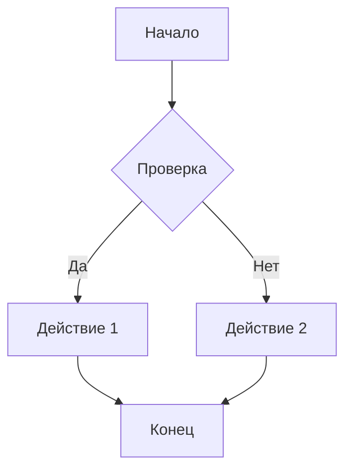
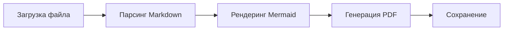

# Тестирование конвертера Markdown

Этот документ содержит все элементы для тестирования конвертера с кириллицей.

## Кириллический текст

Привет, мир! Это тест кириллицы в PDF документе.

**Жирный текст на русском языке**

*Курсивный текст на русском языке*

Проверяем различные символы: АБВГДЕЁЖЗИЙКЛМНОПРСТУФХЦЧШЩЪЫЬЭЮЯ абвгдеёжзийклмнопрстуфхцчшщъыьэюя

## Таблица с кириллицей

| Название | Описание | Цена |
|----------|----------|------|
| Товар 1  | Описание первого товара | 100₽ |
| Товар 2  | Описание второго товара | 200₽ |
| Товар 3  | Описание третьего товара | 300₽ |

## Блок кода

Проверка черного цвета текста в коде:

```python
def привет_мир():
    """Функция с кириллицей"""
    print("Привет, мир!")
    return "Успешно"

# Комментарий на русском
результат = привет_мир()
```

## Mermaid диаграмма

Проверка рендеринга Mermaid диаграммы:



## Еще одна диаграмма



## Список с кириллицей

### Нумерованный список

1. Первый элемент списка
2. Второй элемент списка
3. Третий элемент списка
   - Вложенный элемент
   - Еще один вложенный элемент

### Маркированный список

- Элемент маркированного списка
- Другой элемент
  - Подэлемент 1
  - Подэлемент 2

## Цитата

> Это цитата на русском языке. Проверяем правильность отображения кириллицы в цитатах.
> Вторая строка цитаты.

## Заключение

Все элементы проверены:
- ✅ Кириллица в тексте
- ✅ Кириллица в таблицах
- ✅ Кириллица в коде
- ✅ Mermaid диаграммы
- ✅ Черный цвет в блоках кода
