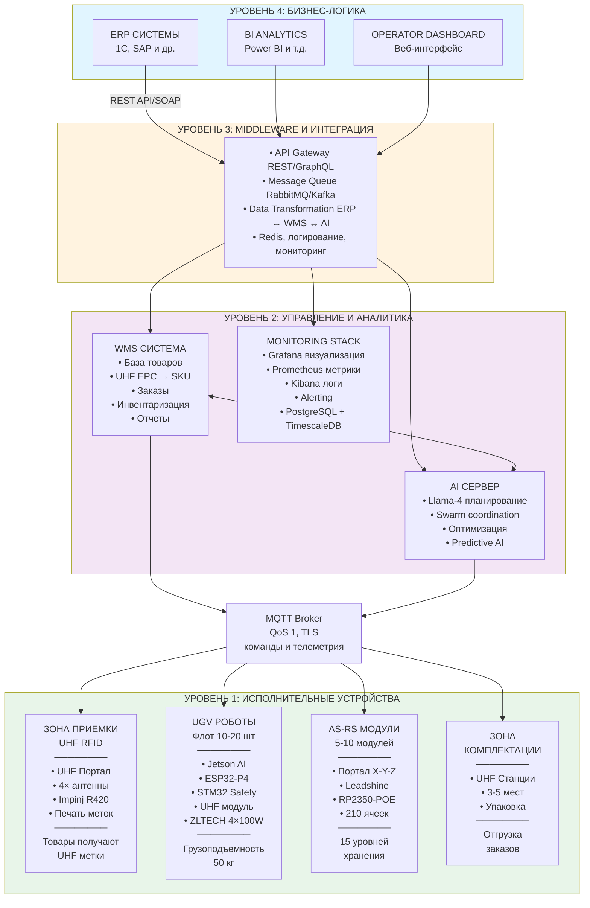

# РАЗДЕЛ 0: ВВЕДЕНИЕ И ОБЩИЙ ОБЗОР ПРОЕКТА

**Проект:** Комплексная система автоматизации склада  
**Документ:** Раздел 0 - Введение и общий обзор  
**Дата:** 16 ноября 2025  
**Версия:** 1.1  
**Статус:** Утвержден к реализации

---

## СОДЕРЖАНИЕ РАЗДЕЛА 0

1. [Назначение системы](#1-назначение-системы)
2. [Архитектура решения](#2-архитектура-решения)
3. [Этапы внедрения (обзор)](#3-этапы-внедрения-обзор)
4. [Варианты масштабирования](#4-варианты-масштабирования)
5. [Методология ценообразования](#5-методология-ценообразования)
6. [Ключевые показатели эффективности](#6-ключевые-показатели-эффективности)

---

## 1. НАЗНАЧЕНИЕ СИСТЕМЫ

### 1.1 Общее описание

Комплексная система автоматизации склада представляет собой интегрированное решение высшего уровня, объединяющее передовые технологии робототехники, искусственного интеллекта, автоматизированного хранения и радиочастотной идентификации (UHF RFID) для создания полностью автоматизированного складского комплекса нового поколения.

**Система решает следующие бизнес-задачи:**

✅ **Максимизация использования складских площадей** - увеличение плотности хранения в 4-5 раз  
✅ **Ускорение обработки грузов** - сокращение времени комплектации заказов в 3-4 раза  
✅ **Снижение операционных затрат** - экономия до 70% на персонале  
✅ **Повышение точности учета** - точность 99.9% vs 95-98% при ручном учете  
✅ **Работа в режиме 24/7** - непрерывная обработка без перерывов  
✅ **Масштабируемость** - гибкое расширение по мере роста бизнеса  
✅ **Прослеживаемость товаров** - полный контроль перемещений в режиме реального времени  

### 1.2 Целевые отрасли применения

| Отрасль | Специфика применения | Ключевые преимущества |
|---------|---------------------|----------------------|
| **E-commerce (Электронная коммерция)** | Высокая скорость обработки заказов (тысячи позиций в день) | Быстрая комплектация, точность сборки 99.9% |
| **Производственные склады** | WIP (Work In Progress), компонентные склады | Точный учет компонентов, защита от дефицита |
| **Фармацевтика** | Строгие требования к учету, сроки годности | FIFO/FEFO автоматически, температурный контроль |
| **Автозапчасти и комплектующие** | Большая номенклатура (50,000+ SKU) | Быстрый поиск, минимизация ошибок подбора |
| **Дистрибьюторские центры** | Кросс-докинг, мультиканальность | Оптимизация маршрутов, минимизация времени хранения |
| **Архивное хранение** | Документы, медиа-архивы | Высокая плотность, быстрый доступ к архивам |
| **Продукты питания (dry storage)** | Склады сухих продуктов, консервов | Контроль сроков, ротация по FIFO |

### 1.3 Решаемые проблемы традиционных складов

**Проблема 1: Низкая плотность хранения**
- Традиционный склад: 2-3 контейнера на 1 м² площади
- Наше решение: **14 контейнеров на 1 м²** (вертикальное хранение на 15 уровнях)
- **Эффект:** Экономия 70% площади или увеличение емкости в 4-5 раз

**Проблема 2: Медленная обработка заказов**
- Традиционный склад: Оператор проходит 10-15 км в смену, собирает 30-40 заказов
- Наше решение: UGV роботы доставляют товары к оператору, 90-120 заказов в смену
- **Эффект:** Производительность в 3× раз выше

**Проблема 3: Высокий уровень ошибок**
- Традиционный склад: 2-5% ошибок при ручной комплектации
- Наше решение: UHF RFID автоматическая верификация, <0.01% ошибок
- **Эффект:** Снижение брака, возвратов, рекламаций

**Проблема 4: Зависимость от человеческого фактора**
- Традиционный склад: Текучесть персонала, больничные, отпуска
- Наше решение: Роботы работают 24/7 без перерывов
- **Эффект:** Стабильная производительность, независимость от кадровой ситуации

**Проблема 5: Отсутствие прослеживаемости**
- Традиционный склад: "Товар где-то на складе", инвентаризация 8-12 часов
- Наше решение: UHF RFID отслеживание в реальном времени, инвентаризация 30-60 минут
- **Эффект:** Полная прозрачность, защита от потерь

---

## 2. АРХИТЕКТУРА РЕШЕНИЯ

### 2.1 Общая схема системы



### 2.2 Ключевые подсистемы

#### 2.2.1 Подсистема 1: UHF RFID (Радиочастотная идентификация)

**Назначение:** Автоматическая идентификация товаров и контейнеров без визуального контакта

**Компоненты:**
- UHF метки на товарах (пассивные, 865-868 МГц)
- UHF метки на контейнерах (усиленные IP67)
- Портал приемки с 4 антеннами (массовое считывание до 200 меток/сек)
- UHF модули на UGV роботах (контроль загрузки)
- Станции верификации в зоне комплектации
- Принтер RFID меток (Zebra ZT411)

**Покрытие:** Весь склад - от приемки до отгрузки

#### 2.2.2 Подсистема 2: UGV Роботы (Unmanned Ground Vehicle)

**Назначение:** Автономная транспортировка контейнеров между зонами склада

**Технические характеристики:**
- Грузоподъемность: 50 кг (безопасная), 68 кг (абсолютный максимум)
- Габариты: 700×500×200 мм
- Скорость: 4.5 км/ч (рабочая), 6.5 км/ч (максимальная)
- Схема движения: 4×4 (все колеса активные)
- Навигация: ArUco метки + AI (точность ±0.5 см)
- Автономность: 6-8 часов активной работы
- Приводы: ZLTECH 4× 100W мотор-колеса
- AI: Jetson Orin Nano (20 TOPS)
- Безопасность: 5-уровневая система защиты

**Флот:** 10-20 роботов (масштабируется)

#### 2.2.3 Подсистема 3: AS-RS (Automated Storage & Retrieval System)

**Назначение:** Вертикальное хранение контейнеров и автоматизированное извлечение

**Технические характеристики модуля:**
- Габариты: 6000×2500×6020 мм (Д×Ш×В)
- Площадь: 15 м²
- Емкость: 210 контейнеров (2 стеллажа × 105 ячеек)
- Уровни: 15 (высота яруса ~390 мм)
- Производительность: 90-120 операций/час
- Точность: ±0.5 мм (по всем осям X, Y, Z)
- Портал: 3 оси (X - 6м, Y - 6м, Z - 0.8м)
- Серводвигатели: Leadshine 750Вт (X), 1000Вт (Y), 400Вт (Z)
- Контроллер: RP2350-POE (Ethernet, Modbus RTU)

**Масштабирование:** 5-10 модулей (1050-2100 контейнеров)

#### 2.2.4 Подсистема 4: AI Сервер (Центральное управление)

**Назначение:** Координация всех подсистем, планирование, оптимизация

**Функции:**
- Планирование траекторий UGV (избегание коллизий)
- Swarm coordination (управление флотом роботов)
- Распределение задач AS-RS (балансировка нагрузки)
- Оптимизация размещения товаров (горячие зоны)
- Прогнозирование спроса (predictive analytics)
- Мониторинг состояния оборудования
- Формирование отчетов и аналитики

**Конфигурация:**
- CPU: AMD EPYC / Intel Xeon (16-32 ядра)
- GPU: NVIDIA A4000 или аналог (AI вычисления)
- RAM: 64-128 GB
- Storage: 2× 2TB NVMe SSD (RAID 1)
- Network: 10 GbE, Wi-Fi 6E Access Point

#### 2.2.5 Подсистема 5: WMS + Middleware (Программное обеспечение)

**Назначение:** Управление складом и интеграция с внешними системами

**Компоненты:**
- WMS (Warehouse Management System) - управление складом
- API Gateway - единая точка входа для внешних систем
- Message Queue (RabbitMQ/Kafka) - очередь задач
- Middleware - трансформация данных между ERP и AI
- База данных PostgreSQL + TimescaleDB
- Мониторинг Grafana + Prometheus

**Интеграции:**
- ERP системы (1C, SAP, Oracle и др.)
- BI аналитика (Power BI, Tableau)
- Транспортные системы (ТМС)

### 2.3 Информационные потоки

**Поток 1: Приемка товара**
```
Поставщик → ERP (накладная) → WMS (задача приемки) → 
→ Оператор (UHF портал считывает метки) → WMS (обновление БД) → 
→ AI Сервер (задача размещения) → UGV (транспортировка) → 
→ AS-RS (размещение в ячейку) → WMS (подтверждение)
```

**Поток 2: Комплектация заказа**
```
Клиент (заказ) → ERP → WMS (формирование задачи) → 
→ AI Сервер (оптимизация маршрута) → AS-RS (извлечение контейнеров) → 
→ UGV (транспортировка к зоне комплектации) → 
→ Оператор (отбор товаров, UHF верификация) → WMS (подтверждение) → 
→ Зона упаковки → Отгрузка
```

**Поток 3: Инвентаризация**
```
WMS (задача инвентаризации) → AI Сервер (маршрут UGV) → 
→ UGV (обход склада с UHF сканированием) → 
→ WMS (автоматическое сопоставление EPC → SKU) → 
→ Отчет о расхождениях (30-60 минут вместо 8-12 часов)
```

---

## 3. ЭТАПЫ ВНЕДРЕНИЯ (ОБЗОР)

### 3.1 Последовательность внедрения

Система внедряется поэтапно, каждый этап добавляет функциональность и интегрируется с предыдущими:

```
ЭТАП 1           ЭТАП 2              ЭТАП 3            ЭТАП 4           ЭТАП 5
  │                 │                   │                 │                │
  ▼                 ▼                   ▼                 ▼                ▼
┌─────────┐    ┌──────────┐      ┌──────────┐      ┌──────────┐    ┌──────────┐
│   UHF   │    │   ЗОНА   │      │   UGV    │      │  AS-RS   │    │   ЗОНА   │
│  RFID   │───►│ ПРИЕМКИ  │─────►│ РОБОТЫ   │─────►│ МОДУЛИ   │───►│КОМПЛЕКТ. │
│МАРКИР.  │    │ (Портал) │      │(с UHF)   │      │(Стеллажи)│    │(Упаковка)│
└─────────┘    └──────────┘      └──────────┘      └──────────┘    └──────────┘
  2-3 нед.       4-6 нед.          6-8 нед.          8-12 нед.       4-6 нед.
```

**+ ЭТАП 6: AI Сервер** (параллельно с Этапом 3-4, 4-6 недель)  
**+ ЭТАП 7: ПО и интеграция** (параллельно с Этапом 2-5, 8-12 недель)

### 3.2 Краткое описание этапов

**ЭТАП 1: Внедрение UHF RFID маркировки** (2-3 недели)
- Закупка UHF меток (пассивные на товары, усиленные на контейнеры)
- Установка принтера RFID меток (Zebra ZT411)
- Разработка схемы кодирования EPC
- Обучение персонала маркировке товаров
- **Результат:** Все товары и контейнеры получают уникальные идентификаторы

**ЭТАП 2: Зона приемки со считыванием UHF** (4-6 недель)
- Изготовление рамы портала приемки (3000×2500×2000 мм)
- Установка UHF считывателя Impinj Speedway R420
- Монтаж 4 антенн (массовое считывание до 200 меток/сек)
- Настройка ПО приемки (RFID Middleware + WMS)
- Интеграция с ERP
- **Результат:** Автоматическая приемка товаров за 2-3 минуты (вместо 15-20 минут вручную)

**ЭТАП 3: UHF роботы (UGV с системой считывания)** (6-8 недель)
- Сборка UGV роботов (1, 10 или 20 единиц по варианту)
- Установка UHF модулей на каждый робот (ThingMagic M6e Nano)
- Разметка склада ArUco метками (навигация)
- Настройка AI планирования траекторий
- Тестирование флота
- **Результат:** Автономная транспортировка контейнеров, контроль загрузки через UHF

**ЭТАП 4: Автоматизированный модульный склад AS-RS** (8-12 недель)
- Изготовление стеллажей и порталов (5-10 модулей по варианту)
- Монтаж направляющих, серводвигателей, захватов
- Установка контроллеров RP2350-POE
- Настройка системы управления (Modbus RTU)
- Интеграция с AI сервером
- Пусконаладка (калибровка, тестирование)
- **Результат:** Вертикальное хранение 1050-2100 контейнеров, производительность 450-1200 операций/час

**ЭТАП 5: Зона комплектования и отгрузка** (4-6 недель)
- Оборудование рабочих мест комплектации (3-5 мест)
- Установка UHF станций верификации
- Настройка конвейерной системы (опционально)
- Обустройство зоны упаковки
- Интеграция с WMS для формирования заказов
- **Результат:** Ускорение комплектации в 3× раза, точность 99.9%

**ЭТАП 6: AI Сервер и система управления** (4-6 недель, параллельно)
- Закупка и сборка сервера (CPU, GPU, RAM, Storage)
- Установка ПО (MQTT, PostgreSQL, Llama-4, Grafana)
- Разработка алгоритмов оптимизации
- Настройка мониторинга и алертинга
- **Результат:** Централизованное управление всеми подсистемами

**ЭТАП 7: ПО и интеграция** (8-12 недель, параллельно)
- Разработка WMS модулей (приемка, размещение, комплектация)
- Создание API Gateway и Middleware
- Интеграция с ERP (1C, SAP)
- Разработка Dashboard для операторов
- Тестирование end-to-end сценариев
- **Результат:** Полная автоматизация складских процессов

### 3.3 Общий срок внедрения

**Пилотный проект (минимальная конфигурация):** 16-20 недель (~4-5 месяцев)  
**Масштабирование-1 (средняя конфигурация):** 20-24 недели (~5-6 месяцев)  
**Масштабирование-2 (полная конфигурация):** 24-28 недель (~6-7 месяцев)

*Сроки указаны с учетом параллельного выполнения этапов 6 и 7*

---

## 4. ВАРИАНТЫ МАСШТАБИРОВАНИЯ

### 4.1 Вариант 1: ПИЛОТНЫЙ ПРОЕКТ (Минимальная конфигурация)

**Назначение:** Тестирование технологии, обучение персонала, оценка эффективности

**Состав системы:**
- UHF RFID маркировка: начальный запас меток (10,000 товарных + 300 контейнерных)
- Зона приемки: 1 UHF портал с 4 антеннами
- UGV роботы: **1 единица** (для тестирования логистики)
- AS-RS модули: **1 модуль** (210 контейнеров, 15 м²)
- Зона комплектации: 3 рабочих места с UHF верификацией
- AI Сервер: 1 единица (базовая конфигурация)
- ПО: базовые модули WMS + интеграция с 1C

**Производительность:**
- Емкость хранения: 210 контейнеров (~1050 товарных позиций при 5 шт/контейнер)
- Обработка: 90-120 операций AS-RS/час
- Комплектация: 30-40 заказов/смену (с 1 UGV)

**Площадь:** ~50-60 м² (зона приемки + AS-RS + комплектация)

**Применение:** 
- Небольшие склады (до 2000 SKU)
- Тестовый запуск перед масштабированием
- Стартапы, малый бизнес

**Стоимость пилота:** Базовая стоимость + **30% резервный фонд**

### 4.2 Вариант 2: МАСШТАБИРОВАНИЕ-1 (Средняя конфигурация)

**Назначение:** Полноценный автоматизированный склад для среднего бизнеса

**Состав системы:**
- UHF RFID маркировка: годовой запас меток (100,000 товарных + 1500 контейнерных)
- Зона приемки: 1 UHF портал (возможность расширения до 2)
- UGV роботы: **10 единиц** (полноценный флот)
- AS-RS модули: **5 модулей** (1050 контейнеров, 75 м²)
- Зона комплектации: 4 рабочих места с UHF верификацией
- AI Сервер: 1 единица (расширенная конфигурация с GPU)
- ПО: полный WMS + интеграция с ERP (1C, SAP)

**Производительность:**
- Емкость хранения: 1050 контейнеров (~5250 товарных позиций при 5 шт/контейнер)
- Обработка: 450-600 операций AS-RS/час (5 модулей параллельно)
- Комплектация: 150-200 заказов/смену (с 10 UGV)

**Площадь:** ~180-200 м² (зона приемки + AS-RS + комплектация + транспортные зоны)

**Применение:**
- Средние склады (5,000-10,000 SKU)
- E-commerce (1000-2000 заказов/день)
- Производственные склады
- Дистрибьюторские центры

**Стоимость:** Базовая стоимость + **25-30% непредвиденные расходы**

### 4.3 Вариант 3: МАСШТАБИРОВАНИЕ-2 (Полная конфигурация)

**Назначение:** Крупный автоматизированный склад для большого бизнеса

**Состав системы:**
- UHF RFID маркировка: 2× годовой запас меток (200,000 товарных + 3000 контейнерных)
- Зона приемки: 1-2 UHF портала (параллельная приемка)
- UGV роботы: **20 единиц** (максимальный флот)
- AS-RS модули: **10 модулей** (2100 контейнеров, 150 м²)
- Зона комплектации: 5 рабочих мест + конвейерная система
- AI Сервер: 1 единица (максимальная конфигурация, multi-GPU)
- ПО: полный WMS + BI аналитика + расширенные интеграции

**Производительность:**
- Емкость хранения: 2100 контейнеров (~10,500 товарных позиций при 5 шт/контейнер)
- Обработка: 900-1200 операций AS-RS/час (10 модулей параллельно)
- Комплектация: 300-400 заказов/смену (с 20 UGV)

**Площадь:** ~350-400 м² (зона приемки + AS-RS + комплектация + буферные зоны)

**Применение:**
- Крупные склады (20,000+ SKU)
- E-commerce лидеры (5000+ заказов/день)
- Крупные производственные склады
- Региональные дистрибьюторские центры

**Стоимость:** Базовая стоимость + **25-30% непредвиденные расходы**

### 4.4 Сравнительная таблица вариантов

| Параметр | Пилот | Масштаб-1 | Масштаб-2 |
|----------|-------|-----------|-----------|
| **UGV роботы** | 1 шт | 10 шт | 20 шт |
| **AS-RS модули** | 1 шт | 5 шт | 10 шт |
| **Емкость (контейнеры)** | 210 | 1,050 | 2,100 |
| **Емкость (товары, ~5 шт/конт)** | ~1,000 | ~5,000 | ~10,000 |
| **Площадь склада** | 50-60 м² | 180-200 м² | 350-400 м² |
| **Производительность AS-RS** | 90-120 оп/ч | 450-600 оп/ч | 900-1200 оп/ч |
| **Заказов в смену** | 30-40 | 150-200 | 300-400 |
| **Рабочих мест комплектации** | 3 | 4 | 5 |
| **Персонал (операторы)** | 2-3 чел | 3-4 чел | 4-6 чел |
| **Срок внедрения** | 16-20 нед | 20-24 нед | 24-28 нед |
| **Резерв в стоимости** | +30% | +25-30% | +25-30% |

### 4.5 Дальнейшее масштабирование

Система проектируется с возможностью неограниченного масштабирования:

**Горизонтальное расширение AS-RS:**
- Стыковка модулей по длине (6м → 12м → 18м → ...)
- Общие стеллажи между модулями (экономия материалов)

**Вертикальное расширение AS-RS:**
- Увеличение высоты стеллажей (6м → 9м → 12м при достаточной высоте потолков)
- Дополнительные уровни хранения (15 → 20 → 30 ярусов)

**Расширение флота UGV:**
- Добавление роботов по мере роста нагрузки (20 → 30 → 50 единиц)
- AI автоматически адаптирует планирование

**Географическое распределение:**
- Несколько автоматизированных складов в разных регионах
- Централизованное управление через облачный AI Сервер

---

## 5. МЕТОДОЛОГИЯ ЦЕНООБРАЗОВАНИЯ

### 5.1 Принципы формирования стоимости

Стоимость проекта рассчитывается по формуле:

```
ОБЩАЯ СТОИМОСТЬ = БАЗОВАЯ СТОИМОСТЬ + РЕЗЕРВ

где:
- БАЗОВАЯ СТОИМОСТЬ = сумма стоимостей всех компонентов и работ
- РЕЗЕРВ = множитель для покрытия рисков и непредвиденных расходов
```

### 5.2 Структура базовой стоимости

Базовая стоимость включает:

**1. Материалы и комплектующие:**
- Электроника (процессоры, контроллеры, датчики)
- Механика (профиль, направляющие, моторы, редукторы)
- Электрика (кабели, разъемы, блоки питания)
- UHF оборудование (считыватели, антенны, метки)
- Аккумуляторы (LiFePO4 для UGV)
- Конструкционные материалы (алюминий, сталь)

**2. Изготовление и сборка:**
- Механическая обработка (фрезеровка, токарка)
- Лазерная резка металла
- Порошковая покраска
- Сборка узлов и агрегатов
- Монтаж электроники
- Прошивка ПО

**3. Программное обеспечение:**
- Разработка WMS модулей
- Интеграция с ERP (адаптеры для 1C, SAP)
- Middleware (API Gateway, Message Queue)
- AI алгоритмы (планирование, оптимизация)
- Dashboard и веб-интерфейсы
- Мобильные приложения

**4. Монтаж и пусконаладка:**
- Транспортировка оборудования
- Установка AS-RS модулей
- Монтаж UHF порталов
- Прокладка кабельных трасс
- Настройка сетевого оборудования
- Калибровка и тестирование
- Обучение персонала

### 5.3 Пилотный проект: +30% резервный фонд

**Обоснование резерва 30% для пилотного проекта:**

Пилотный проект - это первое внедрение технологии, которое несет повышенные риски:

✅ **Закупка малых партий компонентов** (+10-15% к стоимости)
- Поставщики дают меньшие скидки при малых объемах
- Отсутствие оптовых цен
- Дополнительные логистические затраты

✅ **Отладка технологических процессов** (+5-10%)
- Первичная настройка оборудования требует больше времени
- Доработка конструкций на основе тестирования
- Изготовление дополнительных крепежей и адаптеров

✅ **Непредвиденные технические сложности** (+5-8%)
- Проблемы совместимости компонентов
- Необходимость замены отдельных узлов
- Дополнительные доработки ПО

✅ **Расширенное тестирование** (+3-5%)
- Многократные циклы проверки
- Стресс-тесты и испытания
- Документирование результатов

✅ **Резерв на доработки по требованию заказчика** (+2-5%)
- Дополнительные функции
- Изменения в спецификациях
- Кастомизация под конкретные нужды

**Формула расчета пилота:**
```
Стоимость ПИЛОТА = Базовая стоимость × 1.30
```

**Пример:**
- Базовая стоимость UGV робота: 207,309 ₽
- Стоимость в пилотном проекте: 207,309 × 1.30 = **269,502 ₽**

### 5.4 Серийное производство: +25-30% непредвиденные расходы

**Обоснование резерва 25-30% для серийного производства:**

При серийном производстве технология уже отработана, но остаются риски:

✅ **Закупка крупных партий** (СКИДКА -10-20%)
- Оптовые цены от поставщиков
- Снижение логистических затрат на единицу
- Однако: необходим запас на случай брака

✅ **Отлаженные процессы** (ЭКОНОМИЯ -5%)
- Типовые технологические карты
- Повторяемость операций
- Меньше времени на настройку

✅ **НО: Сохраняются риски** (+25-30%)
- **Колебания курса валют** (+5-10%): большинство компонентов импортные
- **Изменение цен поставщиков** (+3-5%): инфляция, дефицит компонентов
- **Брак и замена компонентов** (+3-5%): резерв на бракованные детали
- **Логистические издержки** (+2-4%): таможня, доставка, хранение
- **Дополнительные требования заказчика** (+5-8%): кастомизация, доработки
- **Гарантийное обслуживание** (+2-3%): резерв на гарантийные случаи

**Формула расчета серийного производства:**
```
Стоимость СЕРИЙНАЯ = Базовая стоимость × 1.25 до 1.30
```

**Выбор множителя (1.25 или 1.30):**
- **1.25** - если все компоненты уже в наличии, поставщики надежные, процессы отработаны
- **1.27-1.28** - средний случай, типовой проект
- **1.30** - если есть риски с поставками, сложная логистика, нестандартные требования

**Пример:**
- Базовая стоимость 10 UGV роботов: 2,073,090 ₽
- Стоимость серийная (множитель 1.27): 2,073,090 × 1.27 = **2,632,824 ₽**
- Стоимость серийная (множитель 1.30): 2,073,090 × 1.30 = **2,695,017 ₽**

### 5.5 Структура резерва (детализация)

**Распределение резервного фонда 30% (пилотный проект):**

| Статья расходов | % от базовой стоимости | Назначение |
|-----------------|----------------------|------------|
| Дополнительные компоненты | 8-10% | Закупка резервных деталей, замена брака |
| Доработки конструкций | 5-7% | Изготовление дополнительных креплений, адаптеров |
| Расширенное тестирование | 3-5% | Дополнительные циклы проверки, испытания |
| ПО и интеграция | 4-6% | Доработка софта, отладка API, исправление багов |
| Непредвиденные расходы | 5-7% | Общий резерв на любые неожиданности |
| Обучение и документация | 2-3% | Расширенное обучение персонала, мануалы |
| **ИТОГО РЕЗЕРВ** | **27-38%** | **Средний резерв 30%** |

**Распределение резерва 25-30% (серийное производство):**

| Статья расходов | % от базовой стоимости | Назначение |
|-----------------|----------------------|------------|
| Валютные риски | 5-10% | Колебания курса USD/EUR/CNY |
| Рост цен поставщиков | 3-5% | Инфляция, изменение прайсов |
| Брак и замена | 3-5% | Резерв на бракованные компоненты |
| Логистика | 2-4% | Таможня, доставка, задержки |
| Кастомизация | 5-8% | Доработки под требования заказчика |
| Гарантийный резерв | 2-3% | Обслуживание по гарантии |
| Общий резерв | 3-5% | Непредвиденные ситуации |
| **ИТОГО РЕЗЕРВ** | **23-40%** | **Средний резерв 27-30%** |

### 5.6 Примеры расчета стоимости

**Пример 1: UGV робот (1 единица, пилот)**
```
Базовая стоимость:           207,309 ₽
Резервный фонд (30%):         62,193 ₽
────────────────────────────────────
ИТОГО пилотный проект:       269,502 ₽
```

**Пример 2: UGV роботы (10 единиц, серия)**
```
Базовая стоимость 10 шт:   2,073,090 ₽
Непредвиденные (27%):        559,734 ₽
────────────────────────────────────
ИТОГО серийное произв.:    2,632,824 ₽

Экономия на единицу: 269,502 - 263,282 = 6,220 ₽ (2.3%)
```

**Пример 3: AS-RS модуль (1 единица, пилот)**
```
Базовая стоимость:           905,000 ₽
Резервный фонд (30%):        271,500 ₽
────────────────────────────────────
ИТОГО пилотный проект:     1,176,500 ₽
```

**Пример 4: AS-RS модули (5 единиц, серия)**
```
Базовая стоимость 5 шт:    4,525,000 ₽
Непредвиденные (28%):      1,267,000 ₽
────────────────────────────────────
ИТОГО серийное произв.:    5,792,000 ₽

Стоимость за модуль: 5,792,000 / 5 = 1,158,400 ₽
Экономия на модуль: 1,176,500 - 1,158,400 = 18,100 ₽ (1.5%)
```

### 5.7 Политика скидок при масштабировании

При заказе крупных партий применяются дополнительные скидки:

| Объем заказа | Скидка от базовой стоимости | Резерв |
|--------------|---------------------------|--------|
| Пилот (1-2 ед.) | 0% (стандартная цена) | +30% |
| 3-5 единиц | -3% | +28% |
| 6-10 единиц | -5% | +27% |
| 11-20 единиц | -7% | +26% |
| 21-50 единиц | -10% | +25% |
| 51+ единиц | По договоренности | +25% |

**Пример с учетом скидки:**
```
20 UGV роботов:
Базовая стоимость 20 шт:         4,146,180 ₽
Скидка 7%:                        -290,233 ₽
Базовая со скидкой:              3,855,947 ₽
Непредвиденные (26%):            1,002,546 ₽
────────────────────────────────────────────
ИТОГО 20 роботов:                4,858,493 ₽

За единицу: 242,925 ₽ (экономия 26,577 ₽ vs пилот)
```

---

## 6. КЛЮЧЕВЫЕ ПОКАЗАТЕЛИ ЭФФЕКТИВНОСТИ

### 6.1 Технические KPI

| Показатель | Значение | Сравнение с аналогами |
|------------|----------|---------------------|
| **Точность позиционирования AS-RS** | ±0.5 мм | Лучше чем Dematic (±2 мм) |
| **Точность навигации UGV** | ±0.5 см | Сопоставимо с Amazon Kiva |
| **Скорость операций AS-RS** | 90-120 оп/час | AutoStore: 100 оп/час |
| **Скорость комплектации** | 150-200 заказов/смену | Традиционно: 30-40 заказов |
| **Точность учета UHF RFID** | 99.9% | Штрих-коды: 95-98% |
| **Автономность UGV** | 6-8 часов | Kiva: 4-6 часов |
| **Плотность хранения** | 14 контейнеров/м² | Традиционно: 2-3/м² |

### 6.2 Экономические KPI

**ROI (Return on Investment) - Окупаемость:**

Для масштабирования-1 (10 UGV + 5 AS-RS):
```
Инвестиции: ~18-20 млн ₽
Экономия в год: ~10 млн ₽ (снижение персонала, ускорение оборота)
────────────────────────────────
ROI: 18 месяцев (~1.5 года)
```

**NPV (Net Present Value) - Чистая приведенная стоимость:**
```
За 5 лет эксплуатации:
Инвестиции:        -20,000,000 ₽
Экономия (5 лет):  +50,000,000 ₽
────────────────────────────────
NPV:               +30,000,000 ₽
```

**Снижение операционных затрат:**
- Традиционный склад (персонал): 14,040,000 ₽/год
- Автоматизированный склад: 3,960,000 ₽/год
- **Экономия: 10,080,000 ₽/год (72%)**

### 6.3 Операционные KPI

| KPI | Традиционный склад | Автоматизированный | Улучшение |
|-----|-------------------|-------------------|-----------|
| Заказов в смену | 30-40 | 150-200 | **4-5×** |
| Время комплектации (1 заказ) | 15-20 мин | 4-6 мин | **3×** |
| Ошибок комплектации | 2-5% | <0.01% | **200-500×** |
| Время инвентаризации | 8-12 часов | 30-60 минут | **10-15×** |
| Персонал (операторы) | 10-15 чел | 2-4 чел | **75-80%** |
| Работа в сутки | 8-16 часов | 24 часа | **24/7** |

### 6.4 Конкурентные преимущества

**Vs традиционный склад:**
- ⚡ **В 4× быстрее** обработка заказов
- 📦 **В 5× плотнее** хранение товаров
- 💰 **На 70% дешевле** операционные затраты
- ✅ **В 200× точнее** учет (99.9% vs 95-98%)

**Vs зарубежные аналоги (Amazon Kiva, AutoStore):**
- 💵 **В 3-8× дешевле** стоимость системы
- 🇷🇺 **Полная импортозамещение** - российская разработка
- 🔧 **Легкость обслуживания** - доступность запчастей, техподдержка на русском
- 📈 **Гибкая масштабируемость** - модульная архитектура

---

## ЗАКЛЮЧЕНИЕ ПО РАЗДЕЛУ 0

Комплексная система автоматизации склада представляет собой современное решение, объединяющее:

1. **UHF RFID** - для автоматической идентификации товаров
2. **UGV роботы** - для автономной транспортировки
3. **AS-RS модули** - для плотного вертикального хранения
4. **AI Сервер** - для интеллектуального управления
5. **WMS + Middleware** - для интеграции с бизнес-процессами

**Система внедряется поэтапно** (7 этапов, 16-28 недель в зависимости от масштаба) и **масштабируется гибко** (от пилотного проекта с 1 роботом до крупного склада с 20 роботами и 10 модулями AS-RS).

**Ценообразование прозрачное:**
- Пилотный проект: Базовая стоимость + 30% резерв
- Серийное производство: Базовая стоимость + 25-30% резерв + скидки за объем

**Эффективность доказана:**
- ROI: 18 месяцев
- Экономия: 10 млн ₽/год на операционных затратах
- Производительность: в 4× раз выше традиционного склада

---

**Следующий раздел:** ЭТАП 1 - Внедрение UHF RFID маркировки

**Дата подготовки:** 16 ноября 2025  
**Статус документа:** Утвержден  
**Версия:** 1.1
